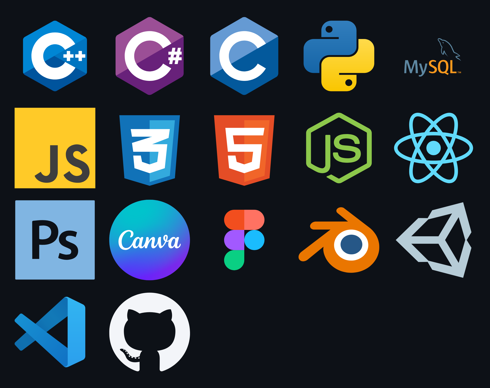

#

## About Me
• Currently a Computer Engineering student at PCCOE 
• Learning Full Stack Development 
• Interested in Web Development, 3D Experiences, and UI Design 
• Exploring DSA and Software Engineering 
• Open to internships and collaborations 

## Profiles
• LinkedIn - https://www.linkedin.com/in/christyfrancis0876/ 
• CodeChef - https://www.codechef.com/users/christyf_99 
• HackerRank - https://www.hackerrank.com/profile/christyfrancis11 
• LeetCode - https://leetcode.com/u/Christy_08/ 

## Tech Stack

  

## Projects
📁 Client Projects  
├── 🌐 PhysioFit Clinic  
│   ├── Responsive Design  
|   ├── SEO Optimized  
│   ├── Appointment Booking  
│   └── https://www.draditisphysiofit.in/  
│  
└── 🌐 Dr. Komal Gupta  
    ├── Professional Healthcare Website  
    ├── Responsive UI/UX  
    └── https://drkomalgupta.com/  
